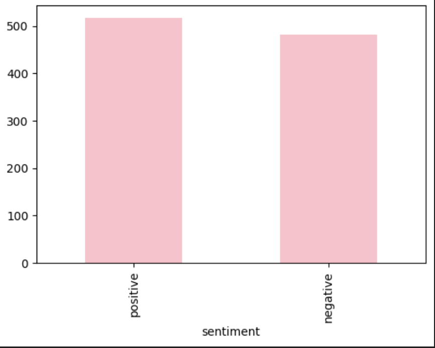
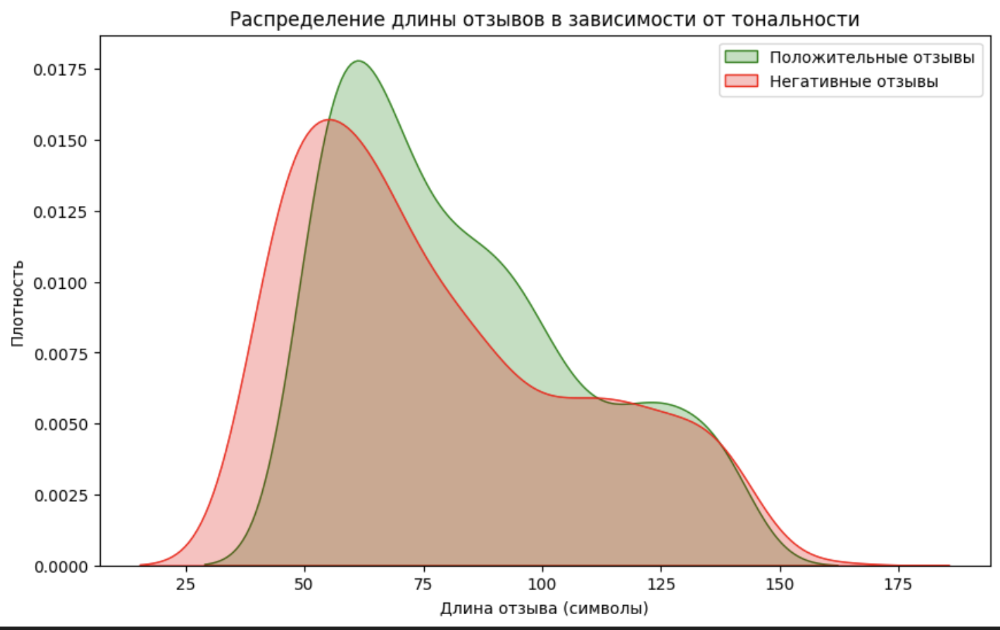
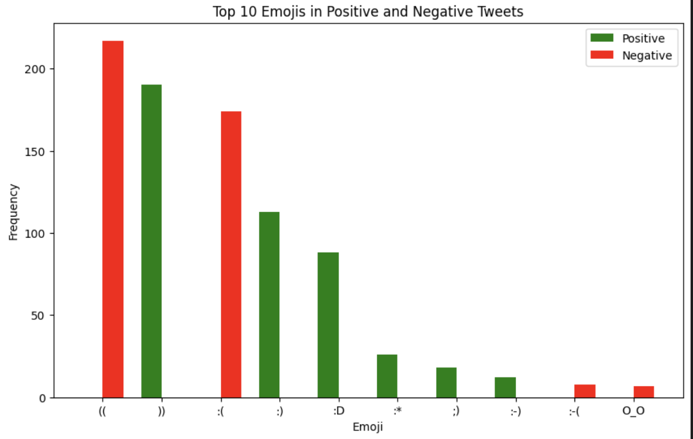

# Twitter sentiment analysis 

[Cсылка на веб-приложение по распознаванию тональности твита](https://51cf195c3edddb6d2d.gradio.live/)

## 🎯 Задание

Вам предоставляется набор данных, содержащий русскоязычные твиты, каждый из которых имеет метку положительной или отрицательной тональности. Вам необходимо обучить модель анализа тональности текста, которая сможет классифицировать новые твиты на положительные и отрицательные.

1. Опишите ваш подход к предварительному анализу и обработке данных, работе с признаками, настройкой модели и ее оценкой. 

2. Объясните выбор того или иного решения и, по возможности, сравните с альтернативами.

3. Опишите, как бы вы улучшили полученную модель, если бы у вас было больше времени и существенно больший датасет.

4. При решении продемонстрируйте не только знания аналитики и машинного обучения, но и инженерные навыки программирования.


## 🚂 Модели

В проекте использованы следующие модели:

### RNN 

- **Параметры обучения**: 100 эпох
- **Метрика оценки**: BinaryAccuracy
- **Результаты**:
  - Точность на обучающей выборке: 0.93
  - Точность на валидационной выборке: 0.91

### LSTM 

- **Параметры обучения**: 100 эпох
- **Метрика оценки**: BinaryAccuracy
- **Результаты**:
  - Точность на обучающей выборке: 0.92
  - Точность на валидационной выборке: 0.88

### BERT 

- **Параметры обучения**: 1 эпоха
- **Метрика оценки**: BinaryAccuracy
- **Результаты**: 
  - Точность на обучающей выборке: 0.83
  - Точность на валидационной выборке: (добавьте значение, если оно доступно)


## 📝 Вопросы

## Предварительный анализ и обработка данных 📊🛠️

### Анализ данных

1. **Обзор данных**
   - Предварительный просмотр  данных
   - Проверка наличия пропущенных значений (нет пропущенных значений)
   - Визуализация распределения тональностей:
        


Как можем увидеть, распределение равномерное, дисбаланса классов нет

2. **Анализ длины текста**
   - Построение гистограмм распределения длины текста для положительных и отрицательных твитов:
           

Была выделена гипотеза о том, что у негативных отзывов длина будет больше, как можем увидеть из графика, длина практически одинаковая, у позитивных отзывов чуть выше. Данный признак будет полезен в дальнейшем/
    
### Обработка текста

1. **Извлечение и анализ смайлов**
   - Написано регулярное выражение для поиска эмодзи и текстовых смайлов
     
   - Анализ самых популярных эмодзи для положительных и отрицательных отзывов:
              
Как можно наблюдать явно выраженные различия по используемым смайликам в позитивных и негативных твитах
     
2. **Обработка нецензурных слов**
   - Написана функция для проверки наличия нецензурных слов
   
   - Применение функции и визуализация, чтобы понять есть ли зависимость между тональностью твита и лексикой ненормативной:
                 
Как и ожидилось нецензурных слов больше в негативных твитах, что можно использовать в дальнейшем для обучения и определения тональности


3. **Предобработка текста**
   - Изначально в baseline- модели использовалась только лемматизация, удаление пунктуационных знаков, html-тегов, в дальнейшем функция для предобработки была улучшена на основании вышепроведенного анализ добавлены замены эмодзи и подсчета матерных слов


## Выбор решений и сравнение моделей

### Базовая модель

На начальном этапе была разработана базовая модель с простой предобработкой текста. Предобработка включала:
- Приведение текста к нижнему регистру.
- Удаление HTML-тегов.
- Удаление пунктуации.
- Удаление стоп-слов.

**Результаты базовой модели:**
- Точность на обучающей выборке: 0.55
- Точность на валидационной выборке: 0.57

### Улучшенные модели

- Для улучшения результатов были использованы более сложные модели и добавление новых вышеописанных признаков
1.  **TF-IDF и Паддинг**
   - **Описание:** Для представления текстов в виде числовых векторов применялись методы TF-IDF, что позволило учесть важность слов в контексте всего корпуса текстов. Для обработки входных данных в нейронных сетях был использован паддинг, чтобы обеспечить одинаковую длину последовательностей.
   - **Результаты:** Упрощенная обработка текста с использованием TF-IDF и паддинга улучшила качество векторных представлений, что способствовало лучшему обучению последующих моделей.


2. **RNN**
   - **Описание:** Рекуррентные нейронные сети хорошо работают с последовательными данными и учитывают контекст.
   - **Результаты:**
     - Точность на обучающей выборке: 0.93
     - Точность на валидационной выборке: 0.91

3. **LSTM**
   - **Описание:** LSTM решает проблему исчезающего градиента и эффективно учитывает долгосрочные зависимости.
   - **Результаты:**
     - Точность на обучающей выборке: 0.92
     - Точность на валидационной выборке: 0.88

4. **BERT**
   - **Описание:** BERT использует трансформеры для глубокого понимания контекста и обеспечивает высокое качество предсказаний.
   - **Результаты:** Модель обучена на 1 эпохе точность составила 0.85

### Заключение
Интересный результат показа модель BERT, которая оказалась очень чувствительна к смайлам в тексте и при их отсуствии распознание тональности было хуже, чем на RNN. Для реализации проекта выбрана RNN, ввиду наилучшей метрики.


## Улучшение модели 🚀

1. **Расширение предобработки данных**
   - Улучшение очистки текста: использовать более сложные методы для удаления шумов и неправильных данных, такие как детекция и удаление нецензурных слов, а также расширила список стоп-слов и фраз.
   - Расширить данные без эмоджи, для улучшения определния тональности
2. **Обогащение данных**
   - Дополнительные источники данных: интегрировать данные из других источников, таких как социальные сети и форумы, для улучшения универсальности модели
   - Аугментация данных: использовать методы аугментации текста, такие как перефразирование и добавление шума, чтобы увеличить объем и разнообразие данных

3. **Оптимизация и тюнинг**
   - Настройка гиперпараметров: использовать методы оптимизации гиперпараметров, такие как сеточный поиск или байесовская оптимизация, для нахождения наилучших параметров модели
   - Кросс-валидация: применять кросс-валидацию для более надежной оценки производительности модели 

## 📚 Библиотеки 

```typescript

import re  # Для работы с регулярными выражениями
import sys  # Для управления путями и аргументами командной строки
import numpy as np  # Для работы с многомерными массивами и матрицами
import pandas as pd  # Для анализа и манипуляций с данными в табличном формате
import string  # Для работы со строками, включая удаление пунктуации
from nltk.corpus import stopwords  # Для работы со списком стоп-слов
from collections import Counter  # Для подсчета частоты встречаемости элементов
from pymystem3 import Mystem  # Лемматизатор для русского языка
import json  # Для работы с JSON-данными
from sklearn.feature_extraction.text import TfidfVectorizer  # Для преобразования текстов в матрицы признаков
import matplotlib.pyplot as plt  # Для создания визуализаций и графиков
import seaborn as sns  # Для создания статистических графиков
from wordcloud import WordCloud  # Для генерации облаков слов
import emoji  # Для работы со смайлами
from vaderSentiment.vaderSentiment import SentimentIntensityAnalyzer  # Для анализа тональности текста
from sklearn.model_selection import train_test_split  # Для разделения данных на обучающие и тестовые выборки
import torch  # Для создания и обучения нейронных сетей
from torch.utils.data import DataLoader, TensorDataset  # Для создания загрузчиков данных и наборов данных
import torch.nn as nn  # Для создания нейронных сетей
import torchutils as tu  # Для вспомогательных функций и утилит для работы с PyTorch
from torchmetrics.classification import BinaryAccuracy  # Для оценки точности бинарной классификации
from dataclasses import dataclass  # Для работы с данными в виде классов
from time import time  # Для измерения времени выполнения операций
from aux.train_rnn import train  # Функция для обучения модели RNN
from aux.rnn_preprocessing import preprocess_single_string  # Функция для предобработки текста для RNN

```

[Cсылка на Google Colab Baseline](https://drive.google.com/file/d/1xkE8q7-_MKxcUw4jXC2PlJN2lh1ryssf/view?usp=sharing)
[Cсылка на Google Colab анализ, предобработка данных, обучение](https://drive.google.com/file/d/1HZKIMbRExJrw2dGLwKtotccpk8s_ynNJ/view?usp=sharing)


